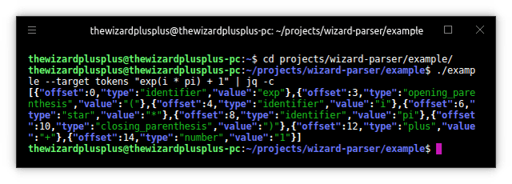

# Wizard Parser

LL(\*)-парсер на C++ с поддержкой DSL для описания грамматики в EBNF непосредственно в коде программы.

## Возможности

* лексинг ASCII-текста:
	* задание лексем посредством регулярных выражений;
	* возможность исключения токенов из результирующего списка;
* парсинг ASCII-текста:
	* описание грамматики на EBNF непосредственно в коде программы (посредством DSL);
* результат:
	* представление в виде:
		* CST;
		* AST;
	* задание имени ноды в дереве;
* парсеры:
	* терминальные:
		* пустота;
		* определённые:
			* текст;
			* лексема;
	* комбинаторы:
		* альтернатива (упорядоченная);
		* объединяющие:
			* следование;
			* повторение:
				* 0 или 1 раз (опциональность);
				* 0 или больше раз;
				* 1 или больше раз;
				* любое число раз в указанном диапазоне;
		* проверяющие:
			* исключение;
			* просмотр вперёд:
				* позитивный;
				* негативный.

## Скриншоты

Лексический анализ

Синтаксический анализ

## Лицензия

The MIT License (MIT)

Copyright &copy; 2015, 2017-2019 thewizardplusplus
